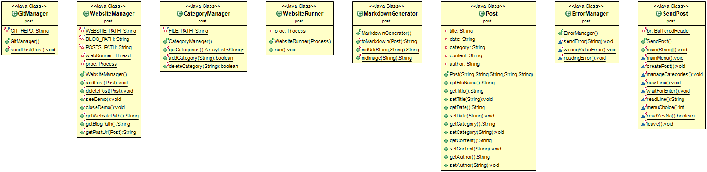

# ACDC 

## Site web statique dynamique

L'objectif de ce projet est de faciliter l'ajout de posts sur un site web se basant sur le générateur de sites statiques [jekyll](https://jekyllrb.com/). 

La version actuelle du projet est une application en invites de commandes. Il aura à terme un interface visuelle.

## Description de l'API

Voici le diagramme de classe utilisé dans l'application:

La documentation JavaDoc est disponible à l'URL [raphael-hascoet.github.io/ACDC/](https://raphael-hascoet.github.io/ACDC/).

## Mise en place

Ce programme requiert :
- [Jekyll](https://jekyllrb.com/)
- [Git](https://git-scm.com/)
- [Java JRE](https://www.oracle.com/technetwork/java/javase/downloads/jre8-downloads-2133155.html)

Vous devrez également lier le dépot de votre site à un dépot distant à l'aide d'une clé ssh. Le dépot par défaut se trouve dans le dossier `web-master`. Suivez [ce lien](https://help.github.com/articles/generating-a-new-ssh-key-and-adding-it-to-the-ssh-agent/#adding-your-ssh-key-to-the-ssh-agent) pour plus d'informations.

Si vous souhaitez modifier le chemin du dépot local, il faudra modifier les attributs constants situés dans la classe `WebsiteManager` (ce processus ne sera plus nécéssaire dans l'application finale car il sera intégré dans l'interface).

## Execution

Une fois le programme mis en place, il existe deux possibilités pour l'utiliser:
- Ouvrir le projet dans une IDE telle que [Eclipse](https://www.eclipse.org/) et l'éxecuter.
- En invite de commandes, utiliser la commande `java -cp bin post.SendPost` dans le dépot principal.
